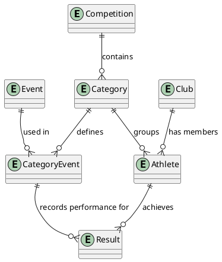

# Entity Model

## Overview

This document describes the core entities of the AI Track and Field application and their relationships. The entity model supports managing track and field competitions, including athlete registration, event participation, result recording, and automated point calculations based on IAAF ranking formulas.

## Entities

### Competition
Represents a track and field competition event.
- Primary Key: `id` (sequence-generated)
- Contains competition metadata (name, date, location, etc.)

### Category
Defines athlete groupings based on gender and birth year ranges.
- Primary Key: `id` (sequence-generated)
- Attributes: gender, year_from, year_to
- Athletes are automatically assigned to categories based on their birth year and gender

### Event
Represents a specific track or field event (e.g., 100m sprint, high jump).
- Primary Key: `id` (sequence-generated)
- Contains event type and performance metrics

### CategoryEvent
Associates events with categories, defining which events athletes in each category will compete in.
- Primary Key: `id` (sequence-generated)
- Links Category and Event in a many-to-many relationship

### Club
Represents athletic clubs or organizations that athletes belong to.
- Primary Key: `id` (sequence-generated)
- Contains club information

### Athlete
Represents individual athletes participating in competitions.
- Primary Key: `id` (sequence-generated)
- Attributes: name, birth year, gender
- Associated with a Club
- Automatically assigned to Category based on birth year and gender

### Result
Records an athlete's performance in a specific event.
- Primary Key: `id` (sequence-generated)
- Contains performance data (time, distance, height, etc.)
- Linked to Athlete and CategoryEvent
- Points are automatically calculated based on IAAF ranking formulas

## Entity Relationship Diagram

## Key Relationships

1. **Competition → Category**: One-to-many. Each competition contains multiple categories.

2. **Category ↔ Event (via CategoryEvent)**: Many-to-many. Categories define which events athletes in that category will compete in. The CategoryEvent junction table manages this relationship.

3. **Club → Athlete**: One-to-many. Each club has multiple athletes.

4. **Category → Athlete**: One-to-many. Athletes are automatically assigned to categories based on their birth year and gender.

5. **Athlete → Result**: One-to-many. Each athlete can have multiple results for different events.

6. **CategoryEvent → Result**: One-to-many. Each category-event combination can have results from multiple athletes.

## Design Decisions

### Sequences for Primary Keys
All entities use database sequences for primary key generation, ensuring unique identifiers across the system.

### CategoryEvent Junction Table
The CategoryEvent entity serves as a junction table linking Categories and Events, allowing flexible configuration of which events belong to which categories. This also serves as the anchor point for recording results.

### Automatic Categorization
Athletes are automatically assigned to categories based on their birth year and gender attributes, ensuring consistent categorization (NFR-004).

### Result Entity Design
Results are linked to both the Athlete and the CategoryEvent (rather than just the Event), ensuring that results are properly contextualized within the competition structure. This design supports the automatic point calculation requirement (FR-007) and ranking functionality (FR-008, FR-009).
