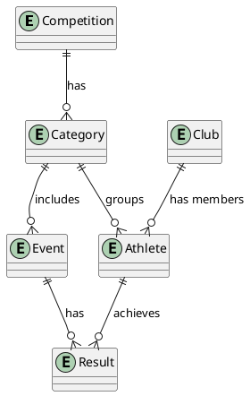

# Entity Model

This document describes the entity model for the track and field competition management system, based on the [requirements document](requirements.md).

## Entities

### Competition
Represents a track and field competition event that is managed by administrators.

### Category
Represents a competition category defined by gender and year range (year from/to). Categories determine which events athletes compete in.

### Event
Represents a specific track and field event (e.g., 100m sprint, long jump, javelin throw) that is part of a category.

### Club
Represents an athletic club that athletes can be affiliated with.

### Athlete
Represents an athlete participating in competitions, with birth year and gender used for automatic category assignment.

### Result
Represents the performance result of an athlete in a specific event, including the measured result and calculated points based on IAAF formulas.

## Entity Relationship Diagram

## Relationships

- **Competition to Category**: One competition has many categories (1:N)
- **Category to Event**: One category includes many events (1:N)
- **Category to Athlete**: One category groups many athletes (1:N)
- **Club to Athlete**: One club has many athlete members (1:N)
- **Athlete to Result**: One athlete achieves many results (1:N)
- **Event to Result**: One event has many results (1:N)

## Primary Keys

All entities use sequences for primary key generation to ensure unique identifiers across the system.
